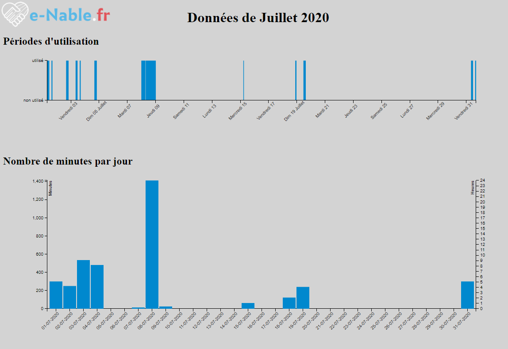

# handMonitorDataViz
Visualisation tool for data recorded by [e-nableHandWearMonitor](https://github.com/reivaxy/e-nableHandWearMonitor)

A web page on which a file downloaded from the e-nableHandWearMonitor device can be dropped to display a graphical representation of the data, with zoom and scroll capabilities.

It will soon also compute statistics like average number of minutes a device is worn each day, ... etc

The web page can be hosted on a website, or loaded from the local computer, it does not need a web server and all the data is processed locally.

You can try it [here](https://reivaxy.github.io/handMonitorDataViz)

 
